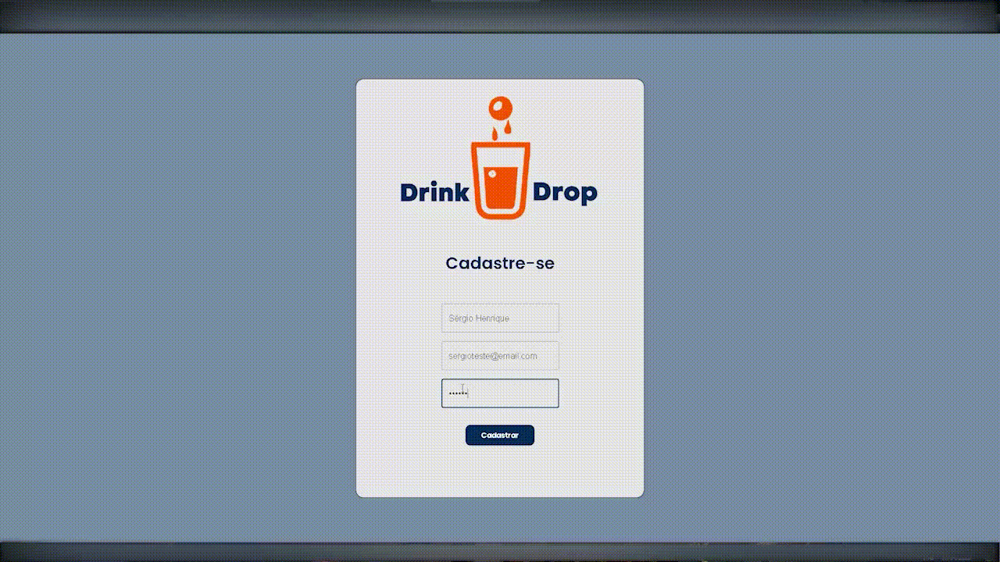

# <h1 align="center">🍺 beer-delivery-app 🍺</h1>
<fig>

</fig>

## Inicialização
Para executar o projeto, utilize as ferramentas descritas na sessão *Ferramentas*.

## Ferramentas
* NPM - Gerenciador de pacotes padrão para execução do JavaScript Node.js
* Docker - Conjunto de produtos de plataforma como serviço que usam virtualização de nível de sistema operacional.
* Docker Compose - Ferramenta usada para definir e executar aplicativos de vários contêineres do Docker
```bash

# Faça o clone
$ git clone git@github.com:sergioruza/beer-delivery-app.git

# Acesse a pasta
$ cd beer-delivery-app

# Rode a aplicação frontend
$ cd ./front-end
$ npm i
$ npm start
# frontend logs
#You can now view frontend in the browser.
#  Local:            http://localhost:300?

# Rode a aplicação back-end
$ cd ./back-end
$ npm i
$ npm run dev
# [nodemon] starting `node .`
# Api rodando na porta 3001

# Suba o contêiner do mongoDB
$ docker-compose up -d

# Vá até a pasta backend e popule o banco
$ cd ./back-end
$ npm run db:reset

```
# beer-delivery-app

## Introdução

Este projeto possui o objetivo principal de criar uma aplicação completa de delivery de cerveja, incluindo frontend e backend,
com os objetivos gerais de firmar conhecimentos em nodeJS com Sequelize, React, MySQL e desenvolvimento em time.

## Análise técnica

### Descrição do ambiente técnico

O sistema é composto de um backend. Linguagem, frameworks e bibliotecas principais utilizadas para a criação:
> Back-End  
 [![javascript][javascript]][javascript-url]
 [![nodejs][nodejs]][nodejs-url]
 [![express][express]][express-url]
 [![sequelize][sequelize]][sequelize-url]
 [![mysql][mysql]][mysql-url]


> Front-End  
 [![javascript][javascript]][javascript-url]
 [![react][react]][react-url]
 [![MUI][MUI]][MUI-url]
[![axios][axios]][axios-url]

### Requisitos Funcionais
Respeitando a proposta, o sistema deverá atender os seguintes requisitos:

* **RF1** - Ter acesso via login;
* **RF2** - Fazer a comunicação entre clientes e pessoas vendedoras;
* **RF3** - Se a pessoa cliente faz o pedido, o mesmo deve aparecer para a pessoa vendedora em seu dash de pedidos após a atualização da página.

## Finais
<details>
 <summary><strong>:memo: Objetivos de Aprendizado</strong></summary><br />

- Construir uma aplicação completa com frontend e backend;

- Trabalhar em equipe;

- Metodologias ágeis;

- Colocar em prática todas as stacks já aprendidas até hoje;

</details>

[javascript]: https://img.shields.io/badge/javascript-F7DF1E?style=for-the-badge&logo=javaScript&logoColor=white
[javascript-url]: https://developer.mozilla.org/en-US/docs/Learn/JavaScript/First_steps

[nodejs]: https://img.shields.io/badge/Node.js-339933?style=for-the-badge&logo=nodedotjs&logoColor=white
[nodejs-url]: https://nodejs.org/en/docs

[express]: https://img.shields.io/badge/express-000000?style=for-the-badge&logo=express&logoColor=white
[express-url]: https://expressjs.com/pt-br/

[sequelize]: https://img.shields.io/badge/sequelize-52B0E7?style=for-the-badge&logo=sequelize&logoColor=white
[sequelize-url]: https://sequelize.org/

[mysql]: https://img.shields.io/badge/mysql-4479A1?style=for-the-badge&logo=mysql&logoColor=white
[mysql-url]: https://www.mysql.com/

[mocha]: https://img.shields.io/badge/mocha-8D6748?style=for-the-badge&logo=mocha&logoColor=white
[mocha-url]: https://mochajs.org/

[react]: https://img.shields.io/badge/react-61DAFB?style=for-the-badge&logo=react&logoColor=white
[react-url]: https://react.dev/

[MUI]: https://img.shields.io/badge/mui-007FFF?style=for-the-badge&logo=mui&logoColor=white
[MUI-url]: https://mui.com/

[axios]: https://img.shields.io/badge/axios-5A29E4?style=for-the-badge&logo=axios&logoColor=white
[axios-url]: https://www.npmjs.com/package/axios


